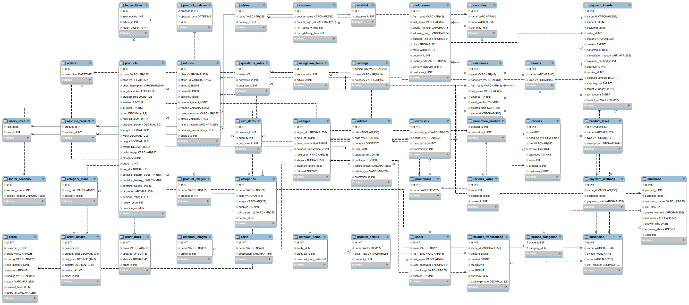

# SellSphere - E-commerce Platform for Electronics

## Overview

SellSphere is a feature-rich e-commerce platform designed to sell electronics efficiently and effectively. The platform leverages modern technologies to deliver a smooth online shopping experience, structured with three modular applications:

- **Admin Panel**: A powerful management interface for handling business operations.
- **Client Application**: A customer-facing storefront for browsing and purchasing products.
- **Keycloak Authorization Server**: Handles secure authentication and authorization.

SellSphere follows an MVC architecture and utilizes internal REST APIs to communicate with the database. This approach enables flexibility in updating the user interface by creating REST APIs for various resources, such as user data or product information. To further enhance its capabilities, the platform integrates with key third-party services, including:

- **Stripe** for secure payment processing.
- **Easyship** for obtaining real-time shipping rates.
- **AWS S3** for scalable and secure file storage.
- **Keycloak** for user authentication, integrated with a custom SPI to work seamlessly with the database customers, event listeners to include my email templates.

### Tech Stack

- **Backend**: Spring, Spring Boot, MySQL
- **Frontend**: Thymeleaf templates, Bootstrap for responsive design
- **Security**: Keycloak, reCAPTCHA v2 (client and server-side validation)
- **Testing**: JUnit, Mockito
- **Utilities**: Lombok, Google Guice, Gson

## ERD

---

## Admin Panel Features

The Admin Panel provides comprehensive tools for managing the e-commerce business:

### Reports
- Generate detailed reports for net and gross sales, including fees, over a specific date range.

### Main Page Management
- **Element Customization**: Adjust the position of elements like product and article sliders.
- **Create New Elements**:
  - **Promotion Carousels**: Showcase products linked to active promotions.
  - **Article Carousels**: Highlight articles for user engagement.

### User Management
- Manage admin users with roles like EDITOR, SHIPPER, ASSISTANT, SALESPERSON, and ADMIN. Add, edit, or delete user accounts.

### Category and Brand Management
- **Categories**: Add, edit, or remove product categories.
- **Brands**: Manage product brands with options to add, update, or delete entries.

### Orders
- View and manage customer orders, including adding tracking details visible to customers.

### Product Management
- Add, update, or delete products in the store's catalog.

### Customer Management
- Enable or disable customer accounts (for users registered through the client application).

### Article Management
- **Create and Manage Articles**:
  - **Promotions**: Link articles to promotions, enabling clients to filter products by active promotions.
  - **Footer Articles**: Content displayed in the site's footer.
  - **Navigation and Free Articles**: Articles for site navigation or general content.

### Review and Question Moderation
- Approve, edit, or delete product reviews and customer questions submitted through the client application.

### Transactions
- View transaction history, payment methods, fees, and manage customer refunds.

### Account Management
- Update and manage admin account details.

### Settings Management
- **General Settings**: Configure site name, logo, currency, and price display.
- **Country and State Management**: Add new shipping countries or states.
- **Mail Server and Templates**: Define email settings and templates for order and registration confirmations.
- **Payment Settings**: Configure tax settings (inclusive/exclusive) with plans for deeper Stripe integration.
- **Shipping Settings**: Define shipping origins and supported countries with Easyship integration for fetching shipping rates.

---

## Client Application Features

The Client Application provides an engaging shopping experience for both desktop and mobile users. Key features include:

### Customer Registration and Authentication
- Secure registration and login through Keycloak, providing robust authentication and access control.

### Wishlist
- Add products to a personal wishlist for easy future access.

### Shopping Cart
- Manage your cart with features to add or remove items, view totals, and proceed to checkout.

### Customer Account Management
- Update personal information, change passwords, and manage account settings.

### Product Reviews
- Customers can leave reviews for products they have purchased, helping inform future buyers.

### Product Questions
- Ask questions about products for clarification and additional details.

### Address Book
- Manage multiple shipping addresses for a more convenient checkout process.

### Order Management
- View past orders and track their progress with updates from shippers.

### Article Reading
- Browse and read articles, including promotions, navigational articles, and general information.

### Product Filtering
- Use advanced filters to narrow down products by product details, price, brand.

### Product Search
- Quickly find products using a powerful search tool powered by MySQL full-text search, providing instant and relevant results.

### Category-Based Browsing
- Explore products by categories for a more focused shopping experience.

### Checkout
- Enjoy a streamlined checkout process with secure payment integration via Stripe.

--- 

## Future Enhancements and Ideas

### 1. Product Variants and Customization
- **Product Types**: Offer configurable product options on the product detail page, such as different memory capacities or color choices for mobiles. This will enhance the customer experience by allowing them to customize their purchase.

### 2. Expanded Stripe Integration
- **Payment Management**: Enable admins to manage payment methods directly from the Admin Panel.
- **Payment Options**: Provide support for cards that require delayed payments or additional authentication steps.

### 3. Customer Information Articles
- **Article Types for Customer Sidebar**: Introduce a new article type that can be displayed on the customer sidebar, offering informational content, tips, or promotional messages tailored to specific customers.

### 4. Enhanced Product Recommendations
- **Personalized Recommendations**: Implement algorithms to provide personalized product recommendations based on browsing and purchasing history.

### 5. Discounts
- **Coupons and Loyalty Programs**: Introduce coupon codes, loyalty points, and reward programs to enhance customer retention.

### 6. Product Bundling
- **Bundle Offers**: Create and manage product bundles with attractive discounts for purchasing related products together.

### 7. Abandoned Cart Recovery
- **Email Reminders**: Automatically send reminders to customers who have left items in their shopping carts without completing the purchase.

---